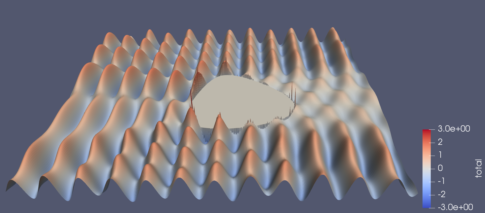

## Aim of this training

Learn how to write Python programs that run efficiently on high performance computers. At the end of this training you will:

 * be able to identify performance bottlenecks in your application
 * understand that there are many ways to write a program (but some ways are better than others)
 * know how to apply different strategies to get your code to run faster

## Prerequisites

To take this training you will need:

 * to be able to log into a Unix computer (and submit jobs if connected to a NeSI computer)
 * be comfortable with typing Unix and git commands
 * know how to use an editor
 * have some knowledge of Python and C/C++

## Getting ready

The training requires:

 * Python 3 (tested with version 3.6.3 and 3.7.3)
 * numpy (tested with 1.13.3 and 1.16.6)
 * scipy (tested with 1.0.0 and 1.2.1)
 * setuptools (tested with 28.8.0 and 40.8.0)
 * Boost library (tested with 1.61 and 1.69)
 * gprof2dot (tested with 2017.9.19)
 * Graphviz (tested with 2.30.1)
 * mpi4py (tested with 2.0.0 and 3.0.1)
 * a C++ compiler with OpenMP support

to be installed and environment variable 
```
export BOOST_DIR=<top-directory-where-boost-is-installed>
```
to be set.

On NeSI's Mahuika Cray CS400 cluster, all these packages are installed and all you need to do is:

```
ml load Python Boost
```
(`BOOST_DIR` will be set for you).

## Scattering wave example problem

We will run the *scatter* code. Clone and switch to the repository:

```
git clone https://github.com/pletzer/scatter.git scatter
cd scatter/original
```

The code computes the scattering of a plane wave against a two-dimensional obstacle

[](images/wave.png)

[Click here to see the incident wave in action](https://youtu.be/FIKSUGk68z8)

As the incoming wave moves from left to right, it encounters the obstacle and gets reflected. 
The obstacle is represented by segments, each responsible for partially reflecting and scattering the wave. 
The sum of the contributions from each segments gives the total scattered wave. 

[Click here to see the scattered wave](https://youtu.be/7ds4S5DCTB8)

[Click here to see the total, incident plus scattered wave](https://youtu.be/zxVEIxZkWyk)

Notice the small wave amplitude on the shadow side of the obstacle. 

### How to run the scatter code

You can run the code interactively
```
python scatter.py
```
or by submitting a job to the scheduler. On Mahuika
```
sbatch scatter.sl
```
where you might have to edit `scatter.sl` and add `#SBATCH --account="myAccount"` as well as other options. [See](https://support.nesi.org.nz/hc/en-gb/articles/360000359576-Slurm-Usage-A-Primer) for more information.


### How to check if the results have changed

When modifying the code, it is important to check that the results haven't changed. Use
```
python scatter.py -c 
```
to record the sum of the field values squared (4686.33935546875). Make sure this value does not change after code editing. 

Note: the check sum changes with resolution and other parameters. 

### Measuring execution time

You can use the `time` command
```
time python scatter.py
```
which may return something like
```
123.36user 0.14system 2:04.67elapsed 99%CPU (0avgtext+0avgdata 49212maxresident)
```
The relevant time is `elapsed`, the wall clock time. The `time` command will send the output to `stderr` so check your error file when running in batch. 

### Adjusting the domain size and contour resolution to control the execution time

As you modify the code you will find it useful to reduce the problem size in order to quickly check that the output has not changed. Likewise you may find it useful to increase the resolution as you improve the code's performance. 

Changing the problem size can be done by passing command line options to `scatter.py`. Type `python scatter.py -h` to see the full list of options. The options that control the grid size are `-nx # -ny #` for the number of cells in the x and y direction. Option `-nc #` sets the number of segments. 

The default values are `-nx 128`, `-ny 128` and `-nc 128`. The execution time scales linearly with the values of options `-nx`, `-ny` and `-nc`. For example:
```
python scatter.py -nx 64 -ny 64 -nc 32
```
will run the code using 64x64 cells and 32 obstacle segments. We expect the code to run `2*2*4 = 16` times faster in this case compared to the default resolution.

## Exercises

 * What is the execution time of the default problem resolution (128x128 and 128 segments)?
 * Modify the scatter.sl script to run with 256x256 and 128 segments. What is the execution time?
 * How does the larger problem execution time compare with the default resolution execution time?

